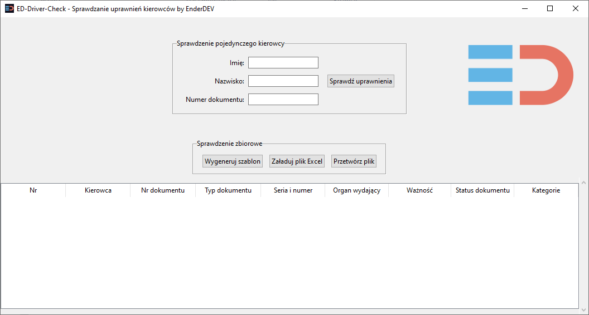

# ED Driver Check

W odpowiedzi na apel branży transportowej o stworzenie skutecznego narzędzia umożliwiającego masową weryfikację uprawnień kierowców postanowiliśmy zadziałać. Opracowaliśmy takie rozwiązanie i udostępniamy je zainteresowanym.

EDDriverCheck umożliwia błyskawiczne sprawdzenie statusu praw jazdy wielu kierowców jednocześnie, co pozwoli pracodawcom na szybkie reagowanie w przypadku wykrycia braku uprawnień.

Uważamy, że bezpieczeństwo powinno być priorytetem, a technologia może odegrać kluczową rolę w zapobieganiu tragediom. Wierzymy, że każda firma zatrudniająca kierowców, niezależnie od wielkości, powinna mieć możliwość skutecznej weryfikacji swoich pracowników.

Aplikacja do sprawdzania uprawnień kierowców, która oferuje dwa tryby pracy: **graficzny (GUI)** oraz **wiersza poleceń (CLI)**

## **Funkcjonalności**
- Tryb **graficzny (GUI)**:
    - Prosty i przejrzysty interfejs
    - Możliwość ręcznego sprawdzania danych pojedynczego kierowcy
    - Możliwość załadowania danych z pliku Excel.
- Tryb **wiersza poleceń (CLI)**:
    - Szybkie przetwarzanie danych
    - Możliwość zapisu do nowego pliku lub nadpisywania istniejącego.

---

## **Sposób użycia**

### **Uruchamianie aplikacji**
Aplikacja domyślnie uruchamia tryb graficzny, jeśli nie zostaną podane żadne argumenty.



```bash
python main.py
````

```cmd
> ed-driver-check.exe -h
usage: ed-driver-check.exe [-h] [--cli] [--gui] [--file FILE] [--output_file OUTPUT_FILE] [--template TEMPLATE]

Aplikacja do sprawdzania uprawnień kierowców.

optional arguments:
  -h, --help            show this help message and exit
  --cli                 Uruchamia aplikację w trybie wiersza poleceń (CLI).
  --gui                 Uruchamia aplikację w trybie graficznym (GUI).
  --file FILE           Ścieżka do istniejącego pliku Excel z danymi do sprawdzenia (tylko w trybie CLI).
  --output_file OUTPUT_FILE
                        Ścieżka do wyjściowego pliku Excel (tylko w trybie CLI).
  --template TEMPLATE   Ścieżka do nowego pliku Excel zawierającego pusty szablon danych (tylko w trybie CLI).

Przykłady użycia:
  ed-driver-check.exe --cli --file dane.xlsx
  ed-driver-check.exe --cli --file dane.xlsx --output_file dane_pelne.xlsx
  ed-driver-check.exe --gui
  ed-driver-check.exe
```